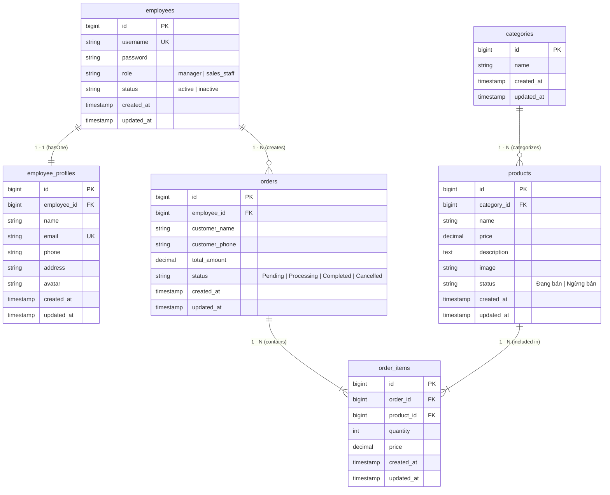
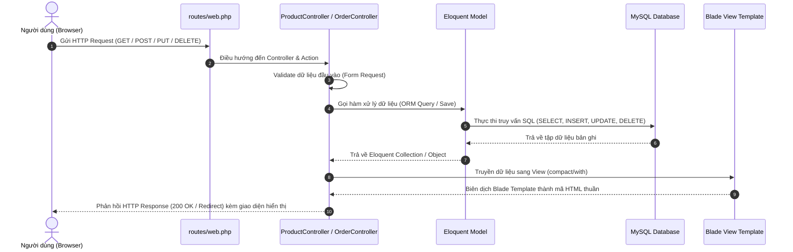
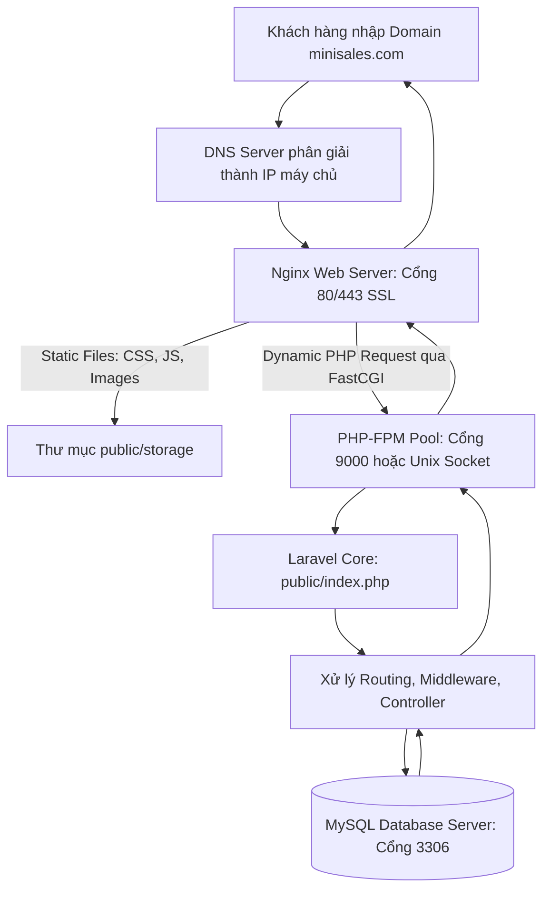

# TÀI LIỆU SƠ ĐỒ ERD & HỆ THỐNG (MINI SALES MANAGEMENT)

## 1. Sơ đồ thực thể quan hệ - ERD (Entity Relationship Diagram)

---

## 2. Sơ đồ System Flow (Luồng xử lý khi thực hiện CRUD)

---

## 3. Sơ đồ quy trình Deploy Server (Deploy Flow)

