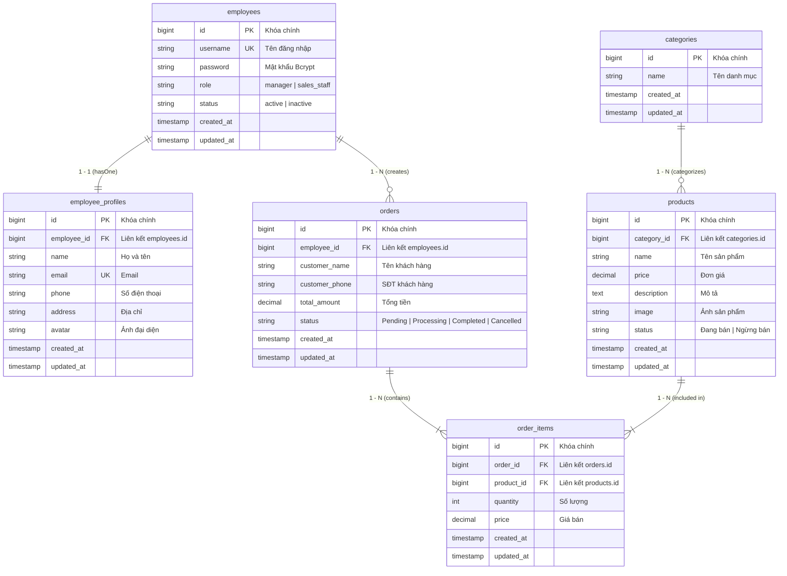
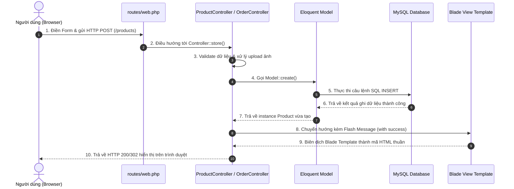
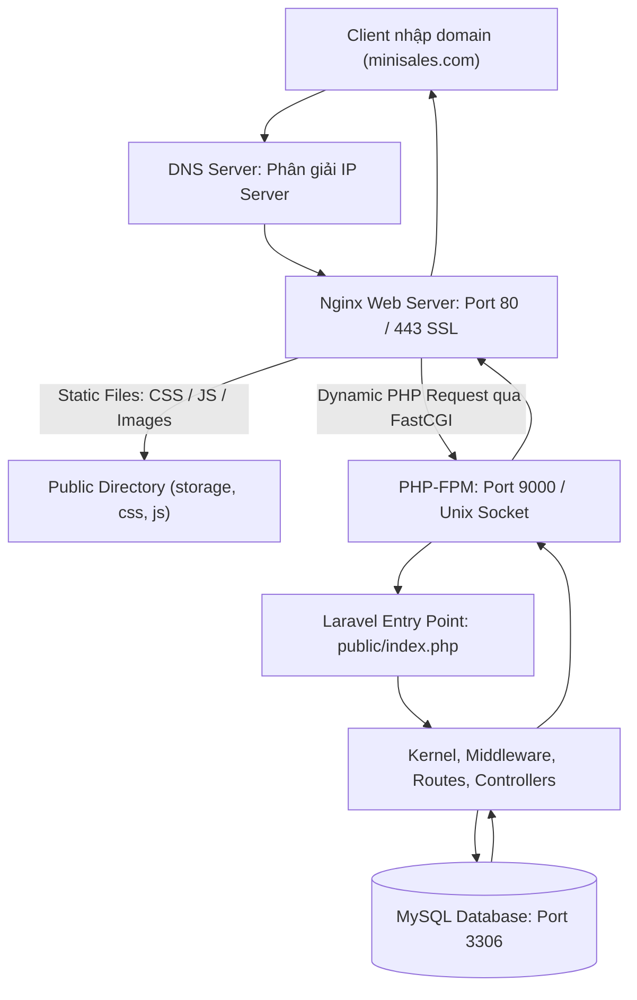

# FINAL PROJECT – MINI SALES MANAGEMENT (Quản lý bán hàng)
> Bài tập cuối khóa đào tạo BRSE (Bridge Software Engineer)

---

## 1. Giới thiệu dự án
Dự án **Mini Sales Management - Dior Beauty** là hệ thống quản lý bán hàng mỹ phẩm cao cấp (Christian Dior Paris) được xây dựng trên nền tảng **Laravel (PHP)** và **MySQL**, áp dụng mô hình **MVC** (Model - View - Controller), giao diện thiết kế chuẩn thời trang **Haute Couture Luxury (HTML5/CSS3 Flexbox & Grid Responsive)**, phân quyền người dùng và flow hệ thống theo tiêu chuẩn đào tạo BRSE.

---

## 2. Tech Stack sử dụng
- **Backend**: PHP 8.1+ / Laravel 10 (MVC, Eloquent ORM, Migrations, Route, Controller, Custom Middleware).
- **Database**: MySQL 8.0 (Quan hệ 1-1, 1-N, N-N).
- **Frontend**: Blade Template Engine, HTML5, CSS3 thuần (Flexbox & Grid layout, Responsive đa thiết bị, Design System sang trọng), JavaScript thuần (DOM, tính toán giỏ hàng realtime, confirm popup). *Không dùng React/Vue/TailwindCSS*.
- **Môi trường phát triển**: Laragon (Apache/Nginx, PHP, MySQL, Composer).

---

## 3. Danh sách tài khoản thử nghiệm (Seeded Data)

| Username | Password | Vai trò (Role) | Họ và tên | Quyền hạn & Phân quyền |
| :--- | :--- | :--- | :--- | :--- |
| `admin` | `password123` | **Quản lý (Manager)** | **Nguyễn Văn Admin** | Toàn quyền hệ thống: Quản lý danh mục, sản phẩm, tất cả đơn hàng, quản lý và cấp quyền nhân viên |
| `sales1` | `password123` | **Nhân viên (Sales Staff)** | **Nguyễn Thị Sale1** | Tạo đơn hàng mới, xem sản phẩm & danh mục, chỉ quản lý các đơn hàng do chính mình phụ trách |
| `sales2` | `password123` | **Nhân viên (Sales Staff)** | **Nguyễn Thị Sale2** | Tạo đơn hàng mới, xem sản phẩm & danh mục, chỉ quản lý các đơn hàng do chính mình phụ trách |

### 3.1. Dữ liệu ngành hàng & Sản phẩm mẫu (Dior Beauty)
- **4 Danh mục chính**: `Son`, `Cushion`, `Nước Hoa`, `Phấn Má` (Trên Dashboard và Sidebar, menu **Quản lý danh mục** được xếp ưu tiên bên trên **Quản lý sản phẩm**).
- **Các sản phẩm Dior tiêu biểu kèm ảnh thương mại thực tế**:
  1. *Son Thỏi Rouge Dior Velvet 999 Iconic Red* (`products/dior-lipstick.jpg`)
  2. *Son Kem Dior Addict Lip Tint Natural Berry* (`products/dior-tint.jpg`)
  3. *Phấn Nước Dior Prestige Le Cushion Teint de Rose* (`products/dior-cushion.jpg`)
  4. *Nước Hoa Nữ Dior J’adore Eau de Parfum 100ml* (`products/dior-perfume.jpg`)
  5. *Nước Hoa Nữ Miss Dior Eau de Parfum 100ml* (`products/miss-dior.jpg`)
  6. *Phấn Má Hồng Dior Rosy Glow 001 Petal Pink* (`products/dior-blush.jpg`)

---

## 4. Các chức năng đã triển khai đầy đủ

### 4.1. Quản lý sản phẩm (`/products`)
- [x] Xem danh sách sản phẩm (Ảnh đại diện, tên, danh mục, đơn giá, trạng thái).
- [x] Tìm kiếm sản phẩm theo tên.
- [x] Lọc sản phẩm theo danh mục và trạng thái (**Đang bán** / **Ngừng bán**).
- [x] Thêm sản phẩm mới kèm upload hình ảnh lưu trữ tại `storage/app/public/products`.
- [x] Xem chi tiết sản phẩm và lịch sử số lượt bán.
- [x] Sửa thông tin sản phẩm và cập nhật ảnh mới.
- [x] Xóa sản phẩm (tự động xóa ảnh cũ).

### 4.2. Quản lý danh mục (`/categories`)
- [x] Danh sách danh mục kèm số lượng sản phẩm thuộc về danh mục đó.
- [x] Thêm danh mục mới (Validate trùng lặp).
- [x] Sửa tên danh mục trực tiếp.
- [x] Xóa danh mục (Có kiểm tra ràng buộc toàn vẹn dữ liệu: không cho phép xóa danh mục khi đang có sản phẩm liên kết).

### 4.3. Quản lý đơn hàng (`/orders`)
- [x] Xem danh sách đơn hàng có phân quyền:
  - **Quản lý**: Xem toàn bộ đơn hàng của mọi nhân viên.
  - **Nhân viên bán hàng**: Chỉ xem các đơn do mình tạo.
- [x] Tạo đơn hàng mới (`/orders/create`):
  - Form nhập thông tin khách hàng (Tên, SĐT).
  - Chọn sản phẩm, số lượng với giao diện JavaScript tự động tính thành tiền từng món và tổng tiền đơn hàng trực tiếp không cần reload trang.
- [x] Xem chi tiết đơn hàng: Thông tin khách hàng, nhân viên tạo, bảng sản phẩm, đơn giá, số lượng, tổng tiền.
- [x] Cập nhật trạng thái đơn hàng: `Pending` $\rightarrow$ `Processing` $\rightarrow$ `Completed` $\rightarrow$ `Cancelled`.
- [x] Xóa đơn hàng.

### 4.4. Quản lý nhân viên & Phân quyền (`/employees` - Dành riêng cho Quản lý)
- [x] Quản lý danh sách nhân viên: Xem avatar, họ tên, username, email, phone, role, status và tổng đơn hàng đã tạo.
- [x] Thêm tài khoản nhân viên mới kèm hồ sơ profile (quan hệ 1-1 giữa `employees` và `employee_profiles`).
- [x] Sửa thông tin, cấp lại mật khẩu hoặc đổi vai trò/trạng thái (Active / Inactive).
- [x] Middleware `CheckManager` ngăn chặn truy cập trái phép từ nhân viên bán hàng (HTTP 403 Forbidden).

### 4.5. Hồ sơ cá nhân (`/profile`)
- [x] Xem và chỉnh sửa thông tin profile (Họ tên, Email, SĐT, Địa chỉ, Avatar cá nhân).
- [x] Đổi mật khẩu tài khoản đang đăng nhập.

---

## 5. Thiết kế Database & Relationship (ERD)



### 5.1. Các bảng trong Database:
1. `employees`: `id`, `username`, `password`, `role`, `status`, `remember_token`, `timestamps`.
2. `employee_profiles`: `id`, `employee_id` (FK), `name`, `email`, `phone`, `address`, `avatar`, `timestamps`.
3. `categories`: `id`, `name`, `timestamps`.
4. `products`: `id`, `category_id` (FK), `name`, `price`, `description`, `image`, `status`, `timestamps`.
5. `orders`: `id`, `employee_id` (FK), `customer_name`, `customer_phone`, `total_amount`, `status`, `timestamps`.
6. `order_items`: `id`, `order_id` (FK), `product_id` (FK), `quantity`, `price`, `timestamps`.

### 5.2. Mối quan hệ (Relationships):
- `Employee` **1 — 1** `EmployeeProfile` (`hasOne` / `belongsTo`)
- `Category` **1 — N** `Product` (`hasMany` / `belongsTo`)
- `Employee` **1 — N** `Order` (`hasMany` / `belongsTo`)
- `Order` **1 — N** `OrderItem` (`hasMany` / `belongsTo`)
- `Product` **1 — N** `OrderItem` (`hasMany` / `belongsTo`)
- `Order` **N — N** `Product` (thông qua bảng trung gian `order_items` với pivot: `quantity`, `price`)

---

## 6. Sơ đồ System Flow (Mục 8 trong yêu cầu)

Luồng tuần tự khi người dùng thực hiện thao tác (Ví dụ: Thêm sản phẩm mới hoặc Tạo đơn hàng):



---

## 7. Quy trình Deploy lên Server thực tế (Mục 10 trong yêu cầu)

### 7.1. Luồng xử lý khi người dùng gõ Domain trên trình duyệt:



1. **Domain & DNS**: Trình duyệt gửi truy vấn DNS để chuyển đổi tên miền `minisales.com` thành địa chỉ IP công khai của máy chủ (Server IP).
2. **Nginx Web Server**: Nhận request HTTPS tại cổng 443, thực hiện giải mã SSL (Certbot Let's Encrypt), phục vụ các file tĩnh (CSS, JS, Images). Nếu là request PHP, Nginx chuyển tiếp (proxy) qua giao thức FastCGI tới PHP-FPM.
3. **PHP-FPM (FastCGI Process Manager)**: Nhận request từ Nginx, khởi tạo PHP process để chạy file `public/index.php` của Laravel.
4. **Laravel Framework**: Khởi tạo Application, xử lý qua HTTP Kernel, Middleware, Router, Controller và truy vấn CSDL qua Eloquent ORM.
5. **MySQL Server**: Tiếp nhận câu lệnh truy vấn SQL, trả về kết quả cho Laravel.
6. **Response**: Laravel biên dịch Blade thành HTML thuần $\rightarrow$ PHP-FPM trả về cho Nginx $\rightarrow$ Nginx phản hồi về trình duyệt của người dùng.

### 7.2. Các bước triển khai thực tế trên máy chủ Ubuntu/Linux:
1. Cài đặt môi trường: Nginx, PHP 8.1-FPM, MySQL 8.0, Composer, Git.
2. Clone mã nguồn: `git clone <repo_url> /var/www/project_mini`
3. Cài đặt dependencies: `composer install --no-dev --optimize-autoloader`
4. Cấu hình biến môi trường: Tạo file `.env`, sinh app key `php artisan key:generate`.
5. Chạy database migration & seeder: `php artisan migrate --force && php artisan db:seed --force`
6. Tạo symbolic link cho thư mục lưu ảnh: `php artisan storage:link`
7. Phân quyền thư mục: `chown -R www-data:www-data storage bootstrap/cache`
8. Cấu hình Nginx Virtual Host trỏ Document Root vào `/var/www/project_mini/public`.
9. Cài đặt chứng chỉ SSL tự động với Certbot: `certbot --nginx -d minisales.com`.

---

## 8. Báo cáo Debug (Mục 9 trong yêu cầu)

- **Issue**: Lỗi `cURL error 60: SSL certificate problem: unable to get local issuer certificate` khi chạy `composer` tải package cài đặt Laravel.
- **Nguyên nhân**: Trên máy tính cài phần mềm diệt virus Avast. Tính năng Web/Mail Shield của Avast thực hiện quét SSL bằng cách tạo chứng chỉ Root Certificate tự ký (`Avast Web/Mail Shield Root`) đưa vào Windows Certificate Store, nhưng file `C:\laragon\etc\ssl\cacert.pem` mặc định của Laragon/PHP chưa có chứng chỉ này.
- **Cách điều tra**: Viết script PHP kiểm tra kết nối SSL verbose và dùng OpenSSL kiểm tra chuỗi chứng chỉ gửi về (`peer_certificate_chain`). Xác định được Issuer là `Avast Web/Mail Shield Root`.
- **Cách xử lý**: Dùng PowerShell trích xuất chứng chỉ gốc `Avast Web/Mail Shield Root` từ Windows Certificate Store và append (nối) vào file `C:\laragon\etc\ssl\cacert.pem` của Laragon.
- **Kết quả**: cURL và Composer xác thực SSL thành công 100%, kết nối Packagist ổn định và cài đặt toàn bộ dependencies bình thường.

---

## 9. Hướng dẫn chạy dự án trên máy tính nội bộ (Local)

1. Mở phần mềm **Laragon** và nhấn **Start All** (khởi động Apache/Nginx và MySQL).
2. Nhấn nút **Terminal** trên giao diện chính của Laragon (hoặc mở PowerShell tại thư mục `C:\laragon\www\Project_mini`).
3. Khởi tạo lại toàn bộ bảng và nạp dữ liệu mẫu mới nhất (Dior Beauty):
   ```bash
   php artisan migrate:fresh --seed
   ```
   *(Nếu dùng PowerShell bên ngoài mà chưa cấu hình biến môi trường PATH cho PHP, chạy: `& 'C:\laragon\bin\php\php-8.1.10-Win32-vs16-x64\php.exe' artisan migrate:fresh --seed`)*
4. Tạo liên kết lưu trữ hình ảnh sản phẩm ra thư mục công khai:
   ```bash
   php artisan storage:link
   ```
5. Xóa sạch bộ nhớ đệm (View, Route, Config) để cập nhật giao diện mới nhất:
   ```bash
   php artisan view:clear && php artisan route:clear && php artisan config:clear
   ```
6. Khởi động server nội bộ (nếu không dùng virtual host của Laragon):
   ```bash
   php artisan serve
   ```
7. Truy cập trình duyệt tại địa chỉ: `http://localhost:8000` (hoặc `http://project_mini.test` trên Laragon).
8. Đăng nhập bằng tài khoản thử nghiệm:
   - **Quản lý (Manager)**: `admin` / `password123` &rarr; Họ tên: **Nguyễn Văn Admin**
   - **Nhân viên 1 (Sales)**: `sales1` / `password123` &rarr; Họ tên: **Nguyễn Thị Sale1**
   - **Nhân viên 2 (Sales)**: `sales2` / `password123` &rarr; Họ tên: **Nguyễn Thị Sale2**
